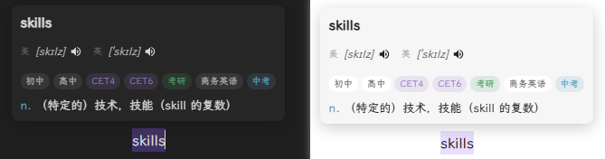

# Fingertip Translation

<div align="center">
  
</div>

[中文文档](docs/README_zh.md)

A simple and efficient text translation plugin for Obsidian that supports multiple translation services, trigger modes, and automatic pronunciation.

## Features

- **Selection Translation** - Hold Ctrl and select text to translate, or use direct selection
- **Multiple Translation Services** - Supports Bing Dictionary, Youdao (automatic Plus/Webpage switching), MyMemory
- **Dictionary Format** - Bing/Youdao display part of speech and exam categories (CET-4, CET-6, etc.)
- **Auto Pronunciation** - Automatically plays pronunciation after successful translation (toggleable)
- **Multiple Accents** - Supports US English and UK English
- **Lightweight** - No API Key required, works out of the box

## Installation

### Method 1: Development Setup

```bash
git clone <repo-url>
cd obsidian-fingertip-translation
npm install
npm run dev
```

### Method 2: Manual Installation

1. Download or clone this repository
2. Run `npm run build` to compile
3. Copy `main.js`, `styles.css`, and `manifest.json` to your vault plugin folder:
   ```
   VaultFolder/.obsidian/plugins/fingertip-translation/
   ```
4. Enable the plugin in Obsidian settings

## Usage

1. Select the text you want to translate in a note
2. A popover will display the translation result (including phonetic symbols, part of speech, definitions)
3. Click the speaker button to manually play pronunciation
4. With "Auto Pronunciation" enabled, pronunciation plays automatically after successful translation
5. Drag the popover to adjust its position
6. Press ESC or click outside to close the popover

## Settings

| Option | Description | Default |
|--------|------------|---------|
| Translation Service | Bing Dictionary / Youdao / MyMemory | Youdao |
| Trigger Mode | Ctrl+Select / Direct Select | Ctrl+Select |
| Pronunciation Source | Youdao Audio / Browser TTS | Youdao Audio |
| Auto Pronunciation | Auto play after translation | Off |
| Pronunciation Accent | US English / UK English | US English |
| Show Phonetic | Display phonetic symbols | On |
| Phonetic Mode | Single accent / Both US and UK | Both |
| Show Category | Display CET-4, CET-6, etc. | On |

## Tech Stack

- **Language**: TypeScript
- **Bundler**: esbuild
- **API**: Obsidian `requestUrl()` (bypasses CORS)

## Project Structure

```
src/
├── main.ts                       # Plugin main entry
├── settings.ts                   # Settings interface
├── tts.ts                        # Pronunciation (Web Speech API)
├── translator-mymemory.ts        # MyMemory Translation API
├── translator-bing.ts            # Bing Dictionary
└── translator-youdao-integrated.ts # Youdao Dictionary (Integrated Plus + Webpage)

styles.css                        # Popover styles
manifest.json                     # Plugin manifest
```

## Translation Services

| Service | Free Quota | API Key | Dictionary Format | Notes |
|---------|------------|---------|-------------------|-------|
| Bing Dictionary | Unlimited | Not needed | Part of speech | Recommended |
| Youdao Dictionary | Unlimited | Not needed | Collins/Exam/Category | Auto fallback |
| MyMemory | 1000/day | Not needed | None | - |

**Youdao Features**:
- Prefers Plus API for richer data
- Auto switches to webpage version when Plus API returns no match
- Displays exam category tags (CET-4, CET-6, Gaokao, IELTS, TOEFL, etc.)
- Shows US/UK accent labels for phonetics

## Developer Guide

```bash
# Install dependencies
npm install

# Development mode (watch for changes and auto-compile)
npm run dev

# Production build
npm run build
```

## License

BSD-0

## References

- [Obsidian Plugin Development Docs](https://docs.obsidian.md)
- [Youdao Dictionary API](https://dict.youdao.com)
- [Bing Dictionary](https://dict.bing.com)
- [MyMemory Translation API](https://mymemory.translated.net/doc/spec.php)
